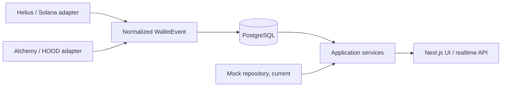

# Pulse architecture

Pulse is a self-hostable wallet-intelligence application. Version 0.1 tracks Solana and Robinhood Chain (HOOD) wallet activity while preserving the existing dashboard UI.

## Current scope

- **Implemented:** shared chain and normalized wallet-event domain types, PostgreSQL schema and Drizzle migration tooling, server-only credential resolution, provider contracts, and a UI-to-service-to-mock-repository boundary.
- **Scaffolded:** database client and provider settings store interface. These are ready to receive database-backed repositories and secure encrypted settings persistence.
- **Planned:** Helius-backed Solana ingestion, Alchemy-backed HOOD ingestion, backfill, subscriptions, and live activity delivery.

## Data model

PostgreSQL is the system of record. Wallets have a chain, address, custom name, optional emoji, and timestamps. Labels and wallet lists use join tables, so labels and list membership are many-to-many relationships.

`WalletEvent` is provider-neutral. It stores the tracked wallet, chain, event type (`buy`, `sell`, `swap`, or `transfer`), token and value details when available, transaction hash/signature, block and detection timestamps, plus optional source metadata. The UI consumes display data derived from this normalized shape rather than provider-specific transaction responses.

## Providers and configuration

The application depends on a small `ChainProvider` contract: connection validation, wallet-history retrieval, transaction lookup, activity subscription, and health reporting. Helius will implement the Solana adapter; Alchemy will implement the HOOD adapter. Neither adapter is implemented or invoked yet.

Provider credentials resolve in this order: environment variables, then a future secure provider-settings store, then unavailable. `HELIUS_API_KEY` and `ALCHEMY_API_KEY` are server-only values and are never passed to client components. Persisted UI-entered credentials are intentionally deferred until server-side encryption is designed.

The current dashboard continues to read fixture data through the application service boundary. Switching to real repositories later should not require provider-specific logic in UI components.
